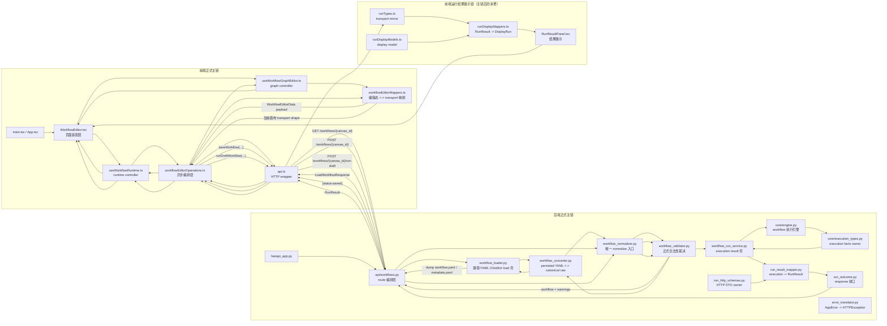

# 项目文件结构
```text
ai-writer-mvp/
├── .venv/                                                         虚拟环境目录；本地 Python 解释器与依赖环境，不属于业务代码
├── api/                                                           后端路由与编排层；承接 workflow、prompt 模板、model resource 与 direct run 相关 HTTP 请求，负责调用 loader / normalizer / validator / run service / store 等正式链路，并将内部错误翻译为 HTTP 响应。
│   ├── __init__.py                                                包标记文件
│   ├── error_translator.py                                        内部 AppError 到 HTTPException 的翻译辅助层
│   ├── model_resource_http_schemas.py                            model resource 管理接口 HTTP transport DTO 层；定义列表项、create/update/delete 请求体与 config health 响应体的 HTTP shape，不负责配置文件原始 shape、runtime registry 或文件 IO。
│   ├── model_resource_reference_service.py                       model resource 删除保护扫描服务层；复用正式 workflow 列表规则，对 workflow.yaml 原始 YAML 做最小引用扫描，生成结构化 delete blocked detail，并在不可安全删除时抛出结构化 AppError。
│   ├── run_http_schemas.py                                        direct run HTTP transport DTO 层；定义 run-draft 请求体与 direct run 响应体，包括 RunDraftRequest、RunResult 与各类 RunStep 投影类型。该层是 API transport contract owner，不负责 engine 内部 execution facts。
│   ├── run_outcome.py                                             direct run 响应收口层；把 workflow_run_service 返回的统一 execution result 转成最终 direct run API response，本身不拥有执行逻辑或 transport schema 定义。
│   ├── run_result_mapper.py                                       execution -> direct run HTTP projection 层；将 WorkflowExecutionResult 和各类 ExecutionStep 单向映射为 RunResult / RunStep 等 transport DTO，只做字段投影与命名对齐。
│   ├── workflow_converter.py                                      持久化 YAML shape 与 canonical raw shape 的转换层；只做 shape mapping，不补默认值、不做合法性裁决、不做旧字段迁移。加载时要求顶层显式包含 nodes / edges / contextLinks；保存时将 canonical workflow model 写回当前正式 YAML 结构。
│   ├── workflow_loader.py                                         workflow 文件系统入口与加载壳层；负责 canvas_id 规范化、workflows/<canvas_id>/workflow.yaml 与 metadata.yaml 的路径规则、YAML 读取写回，以及 editor load / canonical load 分流。当前只接受正式目录布局，不再兼容旧单文件布局或旧字段迁移。
│   ├── workflow_normalizer.py                                     workflow canonical normalize 层；位于 converter 之后、validator 之前，作为 WorkflowEditorData 的唯一 normalize 入口。负责对节点、data edges、contextLinks、position、outputs、llm 与文本字段做最小 shape 收敛，并通过 canonical model 实例化收口 shape-level 合法值。
│   ├── workflow_run_service.py                                    workflow 执行服务层；作为 direct run / run-draft 的统一 execution result 壳层，负责调用 engine 执行 workflow，并把成功/失败路径统一收敛为 WorkflowExecutionResult，补齐 run 级 status、error_*、failure_stage 与 finished_at。
│   ├── workflow_validator.py                                      workflow canonical validator；负责结构校验与依赖校验。结构层检查 nodes / edges / contextLinks、output/stateKey 规则、context link 规则与联合执行关系 DAG；依赖层检查 modelResourceId、prompt 模板可加载性以及模板变量与 data edges 绑定的一致性。
│   └── workflows.py                                               workflow / prompt / model resource 主路由；提供 workflow 列表、加载、保存、run-draft、prompt 模板列表，以及 model resource 的列表、状态、创建、更新、删除接口。route 层只负责请求编排与异常翻译，不拥有 workflow contract、执行引擎或文件 IO 规则。
├── config/                                                        配置目录；放项目级配置，不等于 workflow 实例数据
│   └── model_resources.json                                       model resource 文件配置源；供存储层 strict parse、管理链读写、runtime registry 投影与 health 检查使用。
├── contracts/                                                     共享 contract 层；放跨 storage / core / api / frontend 共同消费的结构定义
│   ├── model_resource_contracts.py                               model resource 共享 contract 层；定义 ModelResourceRecord、引用扫描结果结构，以及“删除被阻止”时的结构化 detail contract，作为 storage / core / api / frontend detail 消费链之间的共同类型锚点。
│   ├── step_projections.py                                       step projection 共享 contract 层；定义 direct run / 展示链共用的 StepProjection 结构，包括 input / prompt / output 的 success/failed step 形状与 PromptWindowMode。该层不是 engine 内部 execution facts owner。
│   └── workflow_contracts.py                                     workflow 共享 canonical contract 层；定义 WorkflowEditorData、WorkflowNode、WorkflowEdge、WorkflowContextLink 及 Input/Prompt/Output 节点 config 的正式 shape，作为前端编辑态、后端 save/load 链与 engine 执行共同围绕的结构锚点。
├── core/                                                          后端核心层；承载工作流执行、内部 execution facts、模型资源解析与 LLM 调用等核心逻辑
│   ├── engine.py                                                  workflow 执行引擎；直接消费已通过 normalize + validator 的 WorkflowEditorData，基于 nodes / edges / contextLinks 构建执行关系图，解析结构化输入绑定，执行 input / prompt / output 节点，维护单次 run 内的 prompt window 运行时状态，并产出 success / failed execution facts。
│   ├── execution_types.py                                         engine 与 workflow_run_service 之间的内部 execution facts contract 层；定义 ExecutionStep、WorkflowExecutionResult 与 WorkflowRunError，区分 step 级 success/failed facts 与 run 级 failure metadata。
│   ├── model_resource_registry.py                                 model resource 运行时 registry 投影层；从 storage 层的 record map 投影出 runtime registry，提供 health 透传与 modelResourceId -> 运行时资源对象的 resolve 入口，不负责文件 IO 或配置写回。
│   └── llm.py                                                     LLM 客户端封装层；统一创建模型客户端并执行调用，消费上游已解析好的 provider/model/api_key/base_url 与 llm 运行参数；不负责 workflow 执行时序、prompt 模板读取或 model resource 解析。
├── docs/                                                          文档目录；放架构说明、设计文档、分析文档、重构记录等
├── frontend-react/                                                前端项目；负责 workflow 编辑、保存、direct run、运行结果展示与 model resource 管理等交互
│   ├── public/                                                    静态资源目录
│   ├── src/                                                       前端源码目录
│   │   ├── assets/                                                前端素材目录
│   │   ├── components/                                            组件层；负责页面渲染、交互展示与页面级装配
│   │   │   ├── NodeConfigPanel.tsx                                节点配置主入口组件；作为当前选中节点的配置编辑入口，负责局部字段编辑、局部 config 组装、节点类型切换与删除/重命名动作触发。底层图规则与保存前合法性不在这里定义。
│   │   │   ├── WorkflowEditor.tsx                                 页面级主控组件；装配 workflow runtime controller 与 graph controller，管理 active/requested canvas、graph dirty 状态、run context、workflow warnings、model resource panel 开关及页面级错误信息，并组织 sidebar、ReactFlow 画布、selection bar、run result panel、node config panel 与 model resource panel。
│   │   │   ├── WorkflowModelResourcePanel.tsx                     model resource 管理侧边面板；当前是复合组件，既负责资源列表与 config health 展示，也负责创建、编辑、删除的局部表单状态、直接 API 调用，以及删除阻止 detail 与基础错误信息展示。
│   │   │   ├── WorkflowNode.tsx                                   自定义节点渲染组件；负责在 ReactFlow 中展示节点样式、连接 Handle、节点摘要，以及执行态高亮、步骤序号、输入预览与最近一次运行输入/输出摘要。
│   │   │   ├── WorkflowSelectionBar.tsx                           选中态工具条；展示当前选中的节点或边，并提供 Duplicate Node、Delete Edge、切换 context link mode 等轻量操作入口。
│   │   │   ├── WorkflowSidebar.tsx                                左侧操作入口组件；提供 canvas 切换与刷新、新增节点、runInputs 编辑、Save / Run / Clear Run State，以及 Model Resources 面板入口。这里只发出页面操作意图，不负责底层图规则、保存校验或运行逻辑。
│   │   │   ├── node-config/                                       节点表单子目录；按节点类型拆分配置 UI
│   │   │   │   ├── InputNodeConfig.tsx                            input 节点表单；编辑 inputKey/defaultValue/output 等 input config 字段
│   │   │   │   ├── OutputNodeConfig.tsx                           output 节点表单；展示 graph-derived inbound 信息并编辑 output 节点自身 config
│   │   │   │   └── PromptNodeConfig.tsx                           prompt 节点配置子表单；负责编辑 promptMode、template/inline prompt、modelResourceId、outputs 与 llm 运行参数，并只读展示 graph-derived 输入信息。
│   │   │   └── run/                                               运行结果展示组件目录；负责展示 workflow direct run 的总体结果、失败摘要、state 概览、步骤时间线、单步详情、写回差异以及值对象渲染
│   │   │       ├── runDisplayMappers.ts                           direct run -> display run 映射层；将后端 RunResult 解释为前端 DisplayRun / DisplayStep，并在前端按 step 顺序重放 published_state，生成 writeback 展示信息与失败摘要。
│   │   │       ├── runDisplayModels.ts                            run display model 层；定义前端展示层消费的 DisplayRun、DisplayStep、DisplayFailureInfo 与 writeback 模型，作为 transport result 与 run 组件之间的 display model 锚点。
│   │   │       ├── runFailure.ts                                  运行失败辅助层；负责提取错误文本、映射 error_type 标签、定位失败步骤并构建展示层失败摘要辅助信息。
│   │   │       ├── runFormatters.ts                               运行展示格式化辅助层；负责 duration_ms 等展示文本格式化
│   │   │       ├── RunResultPanel.tsx                             运行结果总展示面板；展示 run status、失败摘要、主状态面板、执行步骤列表与原始 direct run JSON
│   │   │       ├── RunResultStepCard.tsx                          单步结果卡片组件；在基础步骤卡片上挂接当前步骤的 writeback 展示区
│   │   │       ├── RunResultSteps.tsx                             执行步骤列表组件；按展示顺序渲染各步结果卡片
│   │   │       ├── RunStateOverview.tsx                           运行状态总览组件；展示 inputState 与 primaryState，并总结新增、更新、空写入和未变化字段
│   │   │       ├── RunStepCardBase.tsx                            步骤卡片基础渲染组件；统一展示单步元信息、inputs、prompt、output 与失败详情
│   │   │       ├── RunStepTimeline.tsx                            步骤时间线组件；按时间线样式渲染步骤列表
│   │   │       ├── RunStepWritebackSection.tsx                    步骤写回展示区；展示写回 key、变化标签与前后值
│   │   │       └── RunValueBlock.tsx                              运行值展示基础组件；统一渲染 JSON / 文本值并支持折叠展开
│   │   ├── model-resources/
│   │   │   └── modelResourceTypes.ts                             前端 model resource transport/mirror type 层；定义资源列表项、config health、create/update/delete payload，以及删除阻止 detail 的前端镜像类型。
│   │   ├── run/
│   │   │   └── runTypes.ts                                        前端 direct run transport type 镜像层；镜像后端 RunResult / StepProjection contract，为 api.ts、run display mapper 与 run 组件提供静态类型约束。
│   │   ├── shared/
│   │   │   └── workflowSharedTypes.ts                             前端共享基础类型层；放 WorkflowState、PromptMode 等跨 editor/run 展示共用的轻量类型
│   │   ├── workflow-editor/                                       workflow 编辑器核心目录；放前端 canonical mirror types、图规则、轻量预检、异步编排、派生状态与测试
│   │   │   ├── workflowEditorTypes.ts                             前端 workflow canonical mirror type 层；镜像后端 workflow shared canonical contract，作为 editor domain、API payload 与节点表单编辑的类型锚点。
│   │   │   ├── workflowEditorGraphTypes.ts                        ReactFlow 编辑壳与展示态边/节点相关类型定义层
│   │   │   ├── workflowEditorUiTypes.ts                           前端 controller/action/display 侧的 UI 结果类型定义层
│   │   │   ├── actions/                                           动作层；组织前端编辑动作结果
│   │   │   │   └── workflowEditorActions.ts                       前端编辑动作编排层；根据新增节点、更新节点、重命名、删除、复制、连边、节点变化、边变化等用户动作，协调 node factory / graph / validation 产出统一 action result。
│   │   │   ├── controllers/                                       控制器层；封装与 React 状态和副作用相关的逻辑
│   │   │   │   ├── useWorkflowGraphEditor.ts                      图编辑控制器 Hook；持有 ReactFlow 的 nodes/edges/selection 状态，消费 actions 层结果并落到 React state，同时结合 runResult/runInputs 派生 displayNodes/displayEdges 等视图状态。
│   │   │   │   └── useWorkflowRuntime.ts                          workflow runtime 控制器 Hook；持有 canvasList、prompts、modelResources、runInputs 以及 saving/running/loading 等运行期状态，并封装 workflow 列表刷新、详情加载、保存、direct run 与 runInputs 同步逻辑。
│   │   │   ├── state/                                             派生状态层；从原始编辑态状态生成显示数据与运行态数据
│   │   │   │   ├── workflowEditorRunInputs.ts                     运行输入派生层；根据 input 节点集合与前一轮输入上下文生成当前 runInputs
│   │   │   │   ├── workflowEditorSelection.ts                     轻量选择态辅助层；处理节点/边单选结果、pane 点击清空与 ReactFlow selection change 的基础结果派生
│   │   │   │   └── workflowEditorViewState.ts                     workflow 执行态与 graph truth 的前端视图派生层；根据当前编辑态 nodes/edges/contextLinks 与最近一次 runResult，派生 displayNodes / displayEdges，并为节点补充执行态、inboundBindings、derivedTargetInputs、promptVariableHints 以及 graph truth 的窗口关系摘要。
│   │   │   ├── operations/                                        异步操作层；组织加载、保存、direct run 流程
│   │   │   │   └── workflowEditorOperations.ts                    workflow editor 异步操作层；组织 workflow bootstrap、详情加载、保存与 direct run 等远端交互流程，在 controller 与 api/request helper 之间提供统一结果壳。
│   │   │   ├── domain/                                            领域规则层；放 UI 初始值、图规则、映射、校验、工厂与辅助逻辑
│   │   │   │   ├── promptVariableHints.ts                         prompt 变量提示辅助层；从 inline prompt 文本中提取仅用于展示的变量 hint
│   │   │   │   ├── workflowEditorConfig.ts                        前端节点 config 的 UI 初始值与轻量字段收敛层；负责按节点类型生成新建节点的编辑期初始 config，并对文本字段与 outputs 做最小 trim/coerce。
│   │   │   │   ├── workflowEditorGraph.ts                         前端 graph rule / graph-sync 层；负责图编辑过程中的即时连接规则、节点/边/contextLinks 的局部联动清理、output rename 对出边的同步、context-linked prompt 的局部 modelResourceId 一致性检查，以及联合执行关系的前端轻量环预阻断。
│   │   │   │   ├── workflowEditorHelpers.ts                       workflow editor 轻量公共辅助层；提供 prompt 节点 UI 初始 llm 建议值、默认 output/stateKey 命名辅助，以及新增 prompt output 时的局部命名策略。
│   │   │   │   ├── workflowEditorMappers.ts                       前端编辑态与后端接口态映射层；负责 ReactFlow 节点/边与 workflow transport/canonical payload 之间的双向转换，只做接口 shape 转换与最小收敛，不负责业务校验。
│   │   │   │   ├── workflowEditorNodeFactory.ts                   前端节点工厂层；负责按节点类型生成标准默认 config、创建新的编辑态节点，以及对单个编辑态节点做前端轻量 normalize。
│   │   │   │   ├── workflowEditorRequests.ts                      请求辅助层；封装错误消息提取、canvas/workflow 名称选择与请求结果整理等请求相关公共逻辑
│   │   │   │   ├── workflowEditorSemantic.ts                      前端编辑器语义辅助层；承载局部语义比较与相等性判断等轻量逻辑
│   │   │   │   ├── workflowEditorValidationRules.ts               前端细粒度校验规则层；对当前编辑态做轻量规则检查并返回首个用户可展示的错误字符串，负责 output/stateKey/input binding/contextLink 等基础规则检查，以及 data edges + contextLinks 的联合执行环前端预检。
│   │   │   │   └── workflowEditorValidators.ts                    前端保存前总校验入口层；编排 workflow 保存前的轻量预检顺序。这里只是 UX 层预检，正式 save/load/run contract 仍以后端 normalize + validator 为准。
│   │   │   └── __tests__/                                         前端测试目录；测试 workflow-editor 纯逻辑
│   │   ├── api.ts                                                 前端 HTTP request wrapper 层；封装 workflow、prompt 与 model resource 相关接口请求，提供基础请求/响应类型约束。只负责 transport 调用，不负责组件状态管理、业务流程编排或展示态派生。
│   │   ├── App.css                                                应用样式
│   │   ├── App.tsx                                                顶层组件；挂载 WorkflowEditor 与页面主结构
│   │   ├── index.css                                              全局样式
│   │   └── main.tsx                                               前端启动入口；挂载 React 应用
│   ├── .gitignore                                                 前端忽略配置
│   ├── eslint.config.ts                                           前端规范配置
│   ├── index.html                                                 Vite 入口页面
│   ├── package.json                                               前端依赖与脚本清单
│   ├── package-lock.json                                          前端依赖锁文件
│   ├── README.md                                                  前端说明文档
│   └── vite.config.ts                                             Vite 配置文件
├── prompt/                                                        Prompt 模板目录；template 模式下由 utils/prompt_loader.py 从这里列出模板名并读取正文
├── sessions/                                                      会话/运行历史相关目录；若仓库仍保留该目录，当前不应视为 workflow direct run 主链的一部分
├── shared/
│   └── model_resource_config_shared.py                            model resource 配置共享辅助层；提供配置文件路径与单条配置归一化规则，供 storage 层读取与写回链复用
├── storage/
│   ├── __init__.py                                                包标记文件
│   └── model_resource_store.py                                    model resource 配置文件存储层；作为 config/model_resources.json 的唯一文件 IO owner，负责 strict parse 原始 JSON、构建/读取 ModelResourceRecord map、返回最小文件级 health 状态，并将 record map 整表写回配置文件。
├── utils/                                                         公共工具目录；放可被 route 层和核心层复用的工具函数
│   └── prompt_loader.py                                           prompt 加载工具；负责列出模板名并读取模板内容，不拥有 workflow contract 或运行时执行语义
├── workflows/                                                     workflow 正式存储目录；当前正式布局应为 workflows/<canvas_id>/workflow.yaml 与 metadata.yaml。若目录下仍存在旧单文件 YAML，则应视为历史遗留布局，而非当前正式 save/load 主链。
├── tests/                                                         后端测试目录
├── app.py                                                         Streamlit 直跑入口；绕过 React + FastAPI 主链，直接基于固定 workflow 与用户输入执行 WorkflowEngine，更接近早期演示/辅助脚本，而非当前正式主入口。
├── app_errors.py                                                  项目级业务错误定义；承载 AppError 及其派生错误类型，供 route / service / storage / validator / reference scan 等链路复用
├── fastapi_app.py                                                 FastAPI 主入口；创建 FastAPI app，挂载 CORS 中间件，并将 api.workflows 路由挂到 /api 前缀下，同时提供根路径健康检查接口。按当前代码，这里没有再挂 api.sessions。
├── requirements.txt                                               Python 依赖清单
├── visualize.py                                                   workflow 可视化辅助脚本；读取 YAML/JSON 工作流数据，使用 Graphviz 将节点与边渲染为流程图 PNG，主要用于调试、结构查看或开发辅助，不属于正式运行链。
└── workflow                                                       Graphviz dot 文本产物/可视化中间文件；更像可视化流程生成的中间结果或遗留产物，不是业务代码文件，也不是项目运行入口。

```
## 总图主图

```mermaid
flowchart TB

%% =====================================
%% Legend
%% =====================================
subgraph LG["图例"]
  direction LR
  LG1["普通分层依赖 / 主骨架"]
  LG2["load 链"]
  LG3["save 链"]
  LG4["run-draft 链"]
  LG5["run display 消费链"]
end

LG1 --> LG1A["实线"]
LG2 --> LG2A["实线 + load 标注"]
LG3 -.-> LG3A["虚线 + save 标注"]
LG4 ==> LG4A["粗线 + run 标注"]
LG5 -.-> LG5A["虚线 + display 标注"]

%% =====================================
%% Backend layers
%% =====================================
subgraph BL0["L0 事实源 / 持久化文件层"]
  direction LR
  BFS1["workflows/<canvas_id>/workflow.yaml"]
  BFS2["workflows/<canvas_id>/metadata.yaml"]
  BFS3["config/model_resources.json"]
  BFS4["prompt/*.txt"]
end

subgraph BL1["L1 持久化与共享规则层"]
  direction LR
  BSH1["shared/model_resource_config_shared.py"]
  BST1["storage/model_resource_store.py"]
  BUT1["utils/prompt_loader.py"]
end

subgraph BL2["L2 后端共享 contract / 错误语言层"]
  direction LR
  BCT1["contracts/workflow_contracts.py"]
  BCT2["contracts/step_projections.py"]
  BCT3["contracts/model_resource_contracts.py"]
  BER1["app_errors.py"]
end

subgraph BL3["L3 后端核心运行层"]
  direction LR
  BCO1["core/model_resource_registry.py"]
  BCO2["core/llm.py"]
  BCO3["core/execution_types.py"]
  BCO4["core/engine.py"]
end

subgraph BL4["L4 后端 workflow / run / model-resource 编排层"]
  direction LR
  BAPI1["api/workflow_converter.py"]
  BAPI2["api/workflow_normalizer.py"]
  BAPI3["api/workflow_validator.py"]
  BAPI4["api/workflow_loader.py"]
  BAPI5["api/workflow_run_service.py"]
  BAPI6["api/run_result_mapper.py"]
  BAPI7["api/run_http_schemas.py"]
  BAPI8["api/run_outcome.py"]
  BAPI9["api/model_resource_reference_service.py"]
  BAPI10["api/model_resource_http_schemas.py"]
  BAPI11["api/error_translator.py"]
  BAPI12["api/workflows.py"]
end

subgraph BL5["L5 后端入口层"]
  direction LR
  BAPP1["fastapi_app.py"]
end

%% =====================================
%% Frontend layers
%% =====================================
subgraph FL0["F0 前端共享 / mirror type 层"]
  direction LR
  FFT1["shared/workflowSharedTypes.ts"]
  FFT2["workflowEditorTypes.ts"]
  FFT3["workflowEditorGraphTypes.ts"]
  FFT4["workflowEditorUiTypes.ts"]
  FFT5["runTypes.ts"]
  FFT6["modelResourceTypes.ts"]
end

subgraph FL1["F1 前端 request / transport / operations 层"]
  direction LR
  FFE1["api.ts"]
  FFE2["workflowEditorRequests.ts"]
  FFE3["workflowEditorMappers.ts"]
  FFE4["workflowEditorOperations.ts"]
end

subgraph FL2["F2 前端 domain rule 层"]
  direction LR
  FFD1["workflowEditorHelpers.ts"]
  FFD2["workflowEditorConfig.ts"]
  FFD3["workflowEditorNodeFactory.ts"]
  FFD4["workflowEditorSemantic.ts"]
  FFD5["promptVariableHints.ts"]
  FFD6["workflowEditorValidationRules.ts"]
  FFD7["workflowEditorValidators.ts"]
  FFD8["workflowEditorGraph.ts"]
end

subgraph FL3["F3 前端 state / view derivation 层"]
  direction LR
  FFS1["workflowEditorRunInputs.ts"]
  FFS2["workflowEditorSelection.ts"]
  FFS3["workflowEditorViewState.ts"]
end

subgraph FL4["F4 前端 actions / controllers 层"]
  direction LR
  FFC1["workflowEditorActions.ts"]
  FFC2["useWorkflowRuntime.ts"]
  FFC3["useWorkflowGraphEditor.ts"]
end

subgraph FL5["F5 前端组件 / 展示层"]
  direction LR
  FRP1["runFailure.ts"]
  FRP2["runDisplayModels.ts"]
  FRP3["runDisplayMappers.ts"]
  FRP4["RunResultPanel.tsx"]

  FUI1["WorkflowSidebar.tsx"]
  FUI2["NodeConfigPanel.tsx"]
  FUI3["WorkflowModelResourcePanel.tsx"]
  FUI4["WorkflowEditor.tsx"]
end

subgraph FL6["F6 前端入口层"]
  direction LR
  FENT1["App.tsx"]
  FENT2["main.tsx"]
end

%% =====================================
%% Layer backbone only
%% =====================================
BFS3 --> BSH1 --> BST1
BFS4 --> BUT1

BST1 --> BCO1
BSH1 --> BST1
BCT3 --> BCO1
BCT2 --> BCO3
BCT1 --> BCO4
BCO1 --> BCO4
BCO2 --> BCO4
BCO3 --> BCO4
BUT1 --> BCO4
BER1 --> BCO4

BFS1 --> BAPI1
BCT1 --> BAPI1
BAPI1 --> BAPI2 --> BAPI3 --> BAPI4
BCT1 --> BAPI2
BCO4 --> BAPI5
BCO3 --> BAPI5
BAPI5 --> BAPI6
BCT2 --> BAPI7
BAPI7 --> BAPI6
BAPI6 --> BAPI8
BAPI4 --> BAPI9
BCT3 --> BAPI9
BCT3 --> BAPI10
BER1 --> BAPI11
BAPI2 --> BAPI12
BAPI3 --> BAPI12
BAPI4 --> BAPI12
BAPI5 --> BAPI12
BAPI8 --> BAPI12
BAPI9 --> BAPI12
BAPI10 --> BAPI12
BAPI11 --> BAPI12
BST1 --> BAPI12
BCO1 --> BAPI12
BUT1 --> BAPI12
BER1 --> BAPI12
BAPI12 --> BAPP1

FFT1 --> FFT5
FFT1 --> FFT3
FFT2 --> FFE3
FFT3 --> FFE3
FFT4 --> FFE4
FFT5 --> FFE4
FFT6 --> FFE1
FFT5 --> FFE1
FFT2 --> FFE1
FFE2 --> FFE4
FFE3 --> FFE4

FFT2 --> FFD1
FFD1 --> FFD2 --> FFD3
FFT2 --> FFD4
FFT2 --> FFD5
FFT2 --> FFD6
FFT3 --> FFD6
FFD6 --> FFD7
FFT2 --> FFD8
FFT3 --> FFD8

FFT1 --> FFS1
FFT4 --> FFS2
FFT5 --> FFS3
FFT3 --> FFS3
FFD5 --> FFS3

FFD3 --> FFC1
FFD4 --> FFC1
FFD6 --> FFC1
FFD8 --> FFC1
FFE4 --> FFC2
FFS1 --> FFC2
FFC1 --> FFC3
FFS1 --> FFC3
FFS2 --> FFC3
FFS3 --> FFC3
FFT5 --> FFC3

FFT5 --> FRP2
FRP1 --> FRP3
FRP2 --> FRP3
FFT5 --> FRP3
FRP3 --> FRP4

FFT6 --> FUI3
FFE1 --> FUI3
FFT6 --> FUI1
FFT3 --> FUI1
FFT1 --> FUI1
FFT2 --> FUI2
FFT3 --> FUI2
FFD1 --> FUI2
FFD5 --> FUI2

FFC2 --> FUI4
FFC3 --> FUI4
FRP3 --> FUI4
FUI1 --> FUI4
FUI2 --> FUI4
FUI3 --> FUI4
FRP4 --> FUI4

FUI4 --> FENT1 --> FENT2

%% =====================================
%% Cross app skeleton
%% =====================================
BAPP1 --> FFE1

%% =====================================
%% Load chain
%% =====================================
FENT2 --> FENT1 --> FUI4
FUI4 --> FFC2
FFC2 --> FFE4
FFE4 --> FFE1
FFE1 -- "load: GET /workflows/{canvas_id}" --> BAPI12
BAPI12 -- "load" --> BAPI4
BAPI4 -- "load" --> BAPI1
BAPI1 -- "load" --> BAPI2
BAPI2 -- "load" --> BAPI3
BAPI3 -- "workflow + warnings" --> BAPI12
BAPI12 -- "LoadWorkflowResponse" --> FFE1
FFE1 -- "load response" --> FFE4
FFE4 -- "load into graph" --> FFC3
FFC3 --> FUI4

%% =====================================
%% Save chain
%% =====================================
FFE3 -. "save: editor -> transport" .-> FFE4
FFE4 -. "saveWorkflow(...)" .-> FFE1
FFE1 -. "save: POST /workflows/{canvas_id}" .-> BAPI12
BAPI12 -. "save" .-> BAPI2
BAPI2 -. "save" .-> BAPI3
BAPI3 -. "save" .-> BAPI1
BAPI1 -. "save" .-> BAPI4
BAPI4 -. "dump workflow.yaml / metadata.yaml" .-> BFS1
BAPI4 -. "dump metadata" .-> BFS2
BAPI12 -. "{status:saved}" .-> FFE1
FFE1 -. "save ack" .-> FFE4
FFE4 -. "sync runtime state" .-> FFC2
FFC2 -.-> FUI4

%% =====================================
%% Run-draft chain
%% =====================================
FFE3 ==> FFE4
FFE4 ==>|"runDraftWorkflow(...)"| FFE1
FFE1 ==>|"run: POST /workflows/{canvas_id}/run-draft"| BAPI12
BAPI12 ==>|"run"| BAPI2
BAPI2 ==>|"run"| BAPI3
BAPI3 ==>|"run"| BAPI5
BAPI5 ==>|"execute"| BCO4
BCO4 ==>|"execution facts"| BCO3
BCO3 ==>|"facts back"| BAPI5
BAPI5 ==>|"map result"| BAPI6
BAPI7 --> BAPI6
BAPI6 ==>|"RunResult"| BAPI8
BAPI8 ==>|"response"| BAPI12
BAPI12 ==>|"RunResult"| FFE1
FFE1 ==>|"run response"| FFE4
FFE4 ==>|"update runtime"| FFC2
FFC2 ==> FUI4

%% =====================================
%% Run display consumer chain
%% =====================================
FFE1 -. "RunResult mirror" .-> FFT5
FFT5 -.-> FRP3
FRP3 -. "DisplayRun" .-> FRP4
FRP4 -. "render result" .-> FUI4
```


## 自底向上的 Mermaid 分层图，重点放主链相关文件

```mermaid
flowchart BT

%% =========================
%% Bottom: Facts / Storage
%% =========================
subgraph L0["L0 事实源 / 持久化文件层"]
  direction TB
  FS1["workflows/<canvas_id>/workflow.yaml"]
  FS2["workflows/<canvas_id>/metadata.yaml"]
  FS3["config/model_resources.json"]
  FS4["prompt/*.txt"]
end

subgraph L1["L1 持久化与共享规则层（后端底层）"]
  direction TB
  SH1["shared/model_resource_config_shared.py"]
  ST1["storage/model_resource_store.py"]
  UT1["utils/prompt_loader.py"]
end

FS3 --> SH1
SH1 --> ST1
FS4 --> UT1

%% =========================
%% Backend Core
%% =========================
subgraph L2["L2 后端共享 contract / 错误语言层"]
  direction TB
  CT1["contracts/workflow_contracts.py"]
  CT2["contracts/step_projections.py"]
  CT3["contracts/model_resource_contracts.py"]
  ER1["app_errors.py"]
end

subgraph L3["L3 后端核心运行层"]
  direction TB
  CO1["core/model_resource_registry.py"]
  CO2["core/llm.py"]
  CO3["core/execution_types.py"]
  CO4["core/engine.py"]
end

ST1 --> CO1
ST1 --> CT3
UT1 --> CO4
CT1 --> CO4
CT2 --> CO3
CT3 --> CO1
ER1 --> CO4
CO1 --> CO4
CO2 --> CO4
CO3 --> CO4

%% =========================
%% Backend API / Workflow Chain
%% =========================
subgraph L4["L4 后端 workflow canonical / save-load / run 编排层"]
  direction TB
  API1["api/workflow_converter.py"]
  API2["api/workflow_normalizer.py"]
  API3["api/workflow_validator.py"]
  API4["api/workflow_loader.py"]
  API5["api/workflow_run_service.py"]
  API6["api/run_result_mapper.py"]
  API7["api/run_http_schemas.py"]
  API8["api/run_outcome.py"]
  API9["api/model_resource_reference_service.py"]
  API10["api/model_resource_http_schemas.py"]
  API11["api/error_translator.py"]
  API12["api/workflows.py"]
end

FS1 --> API1
CT1 --> API1
API1 --> API2
CT1 --> API2
API2 --> API3
CO1 --> API3
UT1 --> API3

API4 --> API1
API4 --> API2
API4 --> API3
FS1 --> API4
FS2 --> API4

CO4 --> API5
CO3 --> API5

API5 --> API6
CT2 --> API7
API7 --> API6
API6 --> API8

FS1 --> API9
API4 --> API9
CT3 --> API9

CT3 --> API10
ER1 --> API11

API2 --> API12
API3 --> API12
API4 --> API12
API5 --> API12
API8 --> API12
API9 --> API12
API10 --> API12
API11 --> API12
ST1 --> API12
CO1 --> API12
UT1 --> API12
ER1 --> API12

%% =========================
%% App entry
%% =========================
subgraph L5["L5 后端入口层"]
  direction TB
  APP1["fastapi_app.py"]
end

API12 --> APP1

%% =========================
%% Frontend base types
%% =========================
subgraph F0["F0 前端共享 / mirror type 层"]
  direction TB
  FT1["frontend-react/src/shared/workflowSharedTypes.ts"]
  FT2["frontend-react/src/workflow-editor/workflowEditorTypes.ts"]
  FT3["frontend-react/src/workflow-editor/workflowEditorGraphTypes.ts"]
  FT4["frontend-react/src/workflow-editor/workflowEditorUiTypes.ts"]
  FT5["frontend-react/src/run/runTypes.ts"]
  FT6["frontend-react/src/model-resources/modelResourceTypes.ts"]
end

%% =========================
%% Frontend request / operations
%% =========================
subgraph F1["F1 前端 request / transport / operations 层"]
  direction TB
  FE1["frontend-react/src/api.ts"]
  FE2["frontend-react/src/workflow-editor/domain/workflowEditorRequests.ts"]
  FE3["frontend-react/src/workflow-editor/domain/workflowEditorMappers.ts"]
  FE4["frontend-react/src/workflow-editor/operations/workflowEditorOperations.ts"]
end

FT1 --> FT5
FT1 --> FT3
FT2 --> FE3
FT3 --> FE3
FT4 --> FE4
FT5 --> FE4
FT6 --> FE1
FT5 --> FE1
FT2 --> FE1
FE2 --> FE4
FE3 --> FE4
APP1 --> FE1

%% =========================
%% Frontend domain rules
%% =========================
subgraph F2["F2 前端 domain rule 层"]
  direction TB
  FD1["frontend-react/src/workflow-editor/domain/workflowEditorHelpers.ts"]
  FD2["frontend-react/src/workflow-editor/domain/workflowEditorConfig.ts"]
  FD3["frontend-react/src/workflow-editor/domain/workflowEditorNodeFactory.ts"]
  FD4["frontend-react/src/workflow-editor/domain/workflowEditorSemantic.ts"]
  FD5["frontend-react/src/workflow-editor/domain/promptVariableHints.ts"]
  FD6["frontend-react/src/workflow-editor/domain/workflowEditorValidationRules.ts"]
  FD7["frontend-react/src/workflow-editor/domain/workflowEditorValidators.ts"]
  FD8["frontend-react/src/workflow-editor/domain/workflowEditorGraph.ts"]
end

FT2 --> FD1
FT2 --> FD2
FD1 --> FD2
FD2 --> FD3
FT2 --> FD4
FT2 --> FD5
FT2 --> FD6
FT3 --> FD6
FD6 --> FD7
FT2 --> FD8
FT3 --> FD8
FD6 --> FD8

%% =========================
%% Frontend derived state
%% =========================
subgraph F3["F3 前端 state / view derivation 层"]
  direction TB
  FS10["frontend-react/src/workflow-editor/state/workflowEditorRunInputs.ts"]
  FS11["frontend-react/src/workflow-editor/state/workflowEditorSelection.ts"]
  FS12["frontend-react/src/workflow-editor/state/workflowEditorViewState.ts"]
end

FT1 --> FS10
FT3 --> FS10
FT4 --> FS11
FT3 --> FS11
FT5 --> FS12
FT1 --> FS12
FT2 --> FS12
FT3 --> FS12
FD5 --> FS12

%% =========================
%% Frontend actions / controllers
%% =========================
subgraph F4["F4 前端 actions / controllers 层"]
  direction TB
  FC1["frontend-react/src/workflow-editor/actions/workflowEditorActions.ts"]
  FC2["frontend-react/src/workflow-editor/controllers/useWorkflowRuntime.ts"]
  FC3["frontend-react/src/workflow-editor/controllers/useWorkflowGraphEditor.ts"]
end

FD3 --> FC1
FD4 --> FC1
FD6 --> FC1
FD8 --> FC1

FE4 --> FC2
FS10 --> FC2

FC1 --> FC3
FS10 --> FC3
FS11 --> FC3
FS12 --> FC3
FT5 --> FC3

%% =========================
%% Frontend display
%% =========================
subgraph F5["F5 前端 run display / page components 层"]
  direction TB
  RP1["frontend-react/src/components/run/runFailure.ts"]
  RP2["frontend-react/src/components/run/runDisplayModels.ts"]
  RP3["frontend-react/src/components/run/runDisplayMappers.ts"]
  RP4["frontend-react/src/components/run/RunResultPanel.tsx"]

  UI1["frontend-react/src/components/WorkflowSidebar.tsx"]
  UI2["frontend-react/src/components/NodeConfigPanel.tsx"]
  UI3["frontend-react/src/components/WorkflowModelResourcePanel.tsx"]
  UI4["frontend-react/src/components/WorkflowEditor.tsx"]
end

FT5 --> RP2
RP1 --> RP3
RP2 --> RP3
FT5 --> RP3
RP3 --> RP4

FT6 --> UI3
FE1 --> UI3

FT6 --> UI1
FT3 --> UI1
FT1 --> UI1

FT2 --> UI2
FT3 --> UI2
FD1 --> UI2
FD5 --> UI2

FC2 --> UI4
FC3 --> UI4
RP3 --> UI4
UI1 --> UI4
UI2 --> UI4
UI3 --> UI4
RP4 --> UI4

%% =========================
%% Frontend entry
%% =========================
subgraph F6["F6 前端入口层"]
  direction TB
  ENT1["frontend-react/src/App.tsx"]
  ENT2["frontend-react/src/main.tsx"]
end

UI4 --> ENT1
ENT1 --> ENT2
```

## 核心的正式主链



# “问题 → 文档”总索引表
先给结论：这 10 篇文档现在已经能形成一个完整入口体系，其中 `00` 是总地图，`01/02/03` 解决后端主链问题，`04/05/06/07` 解决前端主链问题，`08` 负责持久化样例与易误解点，`09` 负责跨链路债务与限制。

| 遇到的问题                                                                                      | 优先索引文档                                                                                   | 为什么先看这篇                                                                                                                                |
| ------------------------------------------------------------------------------------------ | ---------------------------------------------------------------------------------------- | -------------------------------------------------------------------------------------------------------------------------------------- |
| 这个项目当前正式主链到底是什么？哪些目录算主链，哪些不算？                                                              | `00-system-map.md`                                                                       | 它专门回答正式主链、系统范围、分层和事实源总表，是整个文档集的入口地图。                                                                                                   |
| workflow 的正式 contract 是什么？`nodes / edges / contextLinks` 各自表达什么？                           | `01-backend-workflow-canonical-and-save-load.md`                                         | 这篇是 canonical workflow contract、converter / normalize / validator / loader 分层的 owner 文档。                                               |
| save/load 链怎么走？editor load 和 canonical load 有什么区别？                                         | `01-backend-workflow-canonical-and-save-load.md`                                         | 它明确区分了 save 正式顺序、editor load 的有限宽松壳，以及 canonical load 的严格入口。                                                                           |
| direct run 链怎么走？`run-draft` 经过哪些层？                                                         | `02-backend-direct-run-and-execution.md`                                                 | 这篇专门钉住 `run-draft -> normalize -> validator -> execute_draft_workflow -> WorkflowEngine.run -> WorkflowExecutionResult -> RunResult`。  |
| `engine` 的内部产物是什么？execution facts 和 HTTP DTO 谁是 owner？                                     | `02-backend-direct-run-and-execution.md`                                                 | 它把三层分离写得最清楚：canonical workflow contract、internal execution facts、direct run HTTP DTO。                                                  |
| success / failed 到底该看什么字段？`final_state` 和 `partial_state` 怎么分？                             | `02-backend-direct-run-and-execution.md`                                                 | 这篇明确写了 success 只看 `final_state`，failed 只看 `partial_state`，并把 run-level error 与 step-level error 分层。                                    |
| prompt window 在运行时怎么实现？`new_window / continue / branch` 的正式语义是什么？                          | `02-backend-direct-run-and-execution.md`                                                 | 只有这篇把 prompt window 作为 run 内内存态机制单独讲清楚。                                                                                                |
| model resource 从配置文件到 runtime resolve 的链路是什么？                                              | `03-backend-model-resource-chain.md`                                                     | 它明确分了 config 事实源、shared 规则层、storage IO owner、runtime registry、删除保护扫描层。                                                                 |
| 删除 model resource 为什么会被阻止？删除扫描看什么？                                                         | `03-backend-model-resource-chain.md`                                                     | 这篇专门解释删除保护扫描如何复用正式 workflow 列表规则，以及它扫描的是 raw YAML 最小引用。                                                                                |
| 前端 editor 现在怎么分层？controller、operations、page、domain 各负责什么？                                  | `04-frontend-editor-architecture.md`                                                     | 这篇是前端 editor 总体分层文档，专门讲 mirror type、operations、controller、页面装配与状态边界。                                                                   |
| 页面状态边界在哪里？`requestedCanvasId` 和 `activeCanvasId` 为什么分开？                                    | `04-frontend-editor-architecture.md`                                                     | 这篇明确解释了页面切换流程、requested/active 双层 canvas 语义和切换失败回退机制。                                                                                  |
| 页面怎么把后端 `RunResult` 和当前页面上下文解耦？`WorkflowRunContext` 是什么？                                   | `04-frontend-editor-architecture.md`                                                     | 它写清了页面层为什么给 `RunResult` 加 ownership 壳，以及 stale 的页面级判定逻辑。                                                                               |
| 前端 graph 规则 owner 在哪里？ReactFlow 壳和保存态/运行态是什么关系？                                            | `05-frontend-graph-rules-and-view-derivation.md`                                         | 它专门回答 graph rule owner、前端预检与后端 validator 的边界、以及 UI shell 与 canonical contract 的区别。                                                     |
| 前端预检能做到什么，不能做到什么？                                                                          | `05-frontend-graph-rules-and-view-derivation.md`                                         | 这篇明确说前端预检只是 UX 层快速暴露，后端 normalize + validator 才是正式裁决者。                                                                                 |
| 前端如何把 `RunResult` 变成 `DisplayRun`？`failure summary`、`writeback diff`、`primaryState` 在哪里生成？ | `06-frontend-run-display-chain.md`                                                       | 这篇是 run display 专文，明确 transport mirror、display model、display mapper、failure helper、展示组件链。                                              |
| stale run 是哪一层的语义？为什么后端没有这个字段？                                                             | `06-frontend-run-display-chain.md`，必要时补看 `04-frontend-editor-architecture.md`            | `06` 讲 stale 是 display/page 语义，`04` 讲页面通过 `WorkflowRunContext` 和 semantic version 注入 stale。                                            |
| 前端 model resource 面板为什么说是复合组件？删除阻止 detail 怎么在前端消费？                                         | `07-frontend-model-resource-panel.md`                                                    | 这篇直接定义 `WorkflowModelResourcePanel.tsx` 的真实定位，并列出它内聚的 UI、状态、API、错误解析、删除 detail 展示职责。                                                   |
| 当前正式持久化文件长什么样？`workflow.yaml`、`metadata.yaml`、`model_resources.json` 分别扮演什么角色？             | `08-persistent-shape-examples.md`                                                        | 这篇就是三类持久化文件的样例和职责解释文档。                                                                                                                 |
| `contextLinks: []` 是不是等于没有窗口语义？                                                            | `08-persistent-shape-examples.md`                                                        | 这篇明确写了：`contextLinks: []` 不等于没有窗口语义，而等于运行时按无 inbound link 推导为 `new_window`。                                                            |
| Output 节点为什么说已经接近 aggregate？                                                               | `08-persistent-shape-examples.md`，必要时补看 `01-backend-workflow-canonical-and-save-load.md` | `08` 从真实样本解释当前行为已接近 aggregate，`01` 解释 canonical type 仍是 `output` 以及后续迁移边界。                                                             |
| prompt 多输出为什么要求 JSON object，且 key 必须对齐 outputs.name？                                       | `08-persistent-shape-examples.md`，必要时补看 `02-backend-direct-run-and-execution.md`         | `08` 说明保存态多输出 shape 如何约束运行时 structured output，`02` 说明 engine 在执行期如何严格要求 JSON object 和 key 集合一致。                                        |
| 当前系统有哪些技术债？哪些是阶段性可接受限制，哪些是后续必须收口的问题？                                                       | `09-known-limits-and-technical-debt.md`                                                  | 这是全局债务总表，按 save/load、model resource、frontend graph/view、frontend run display/管理面板四条链分布整理。                                              |
| 不确定问题归哪条链，应该先看哪里？                                                                          | 先看 `00-system-map.md`，再按 backend / frontend / persistence / debt 分流                      | `00` 是总入口，它先把系统分成 backend save-load、backend direct run、backend model resource、frontend 主链和事实源表。                                        |

