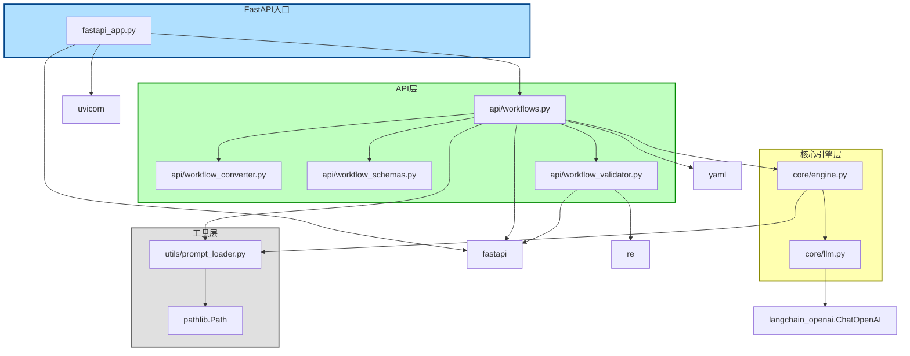
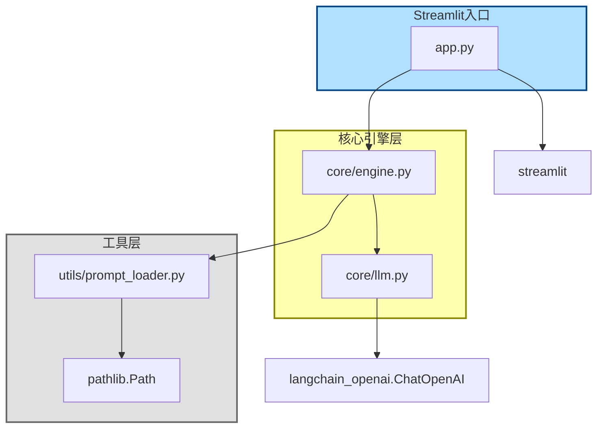
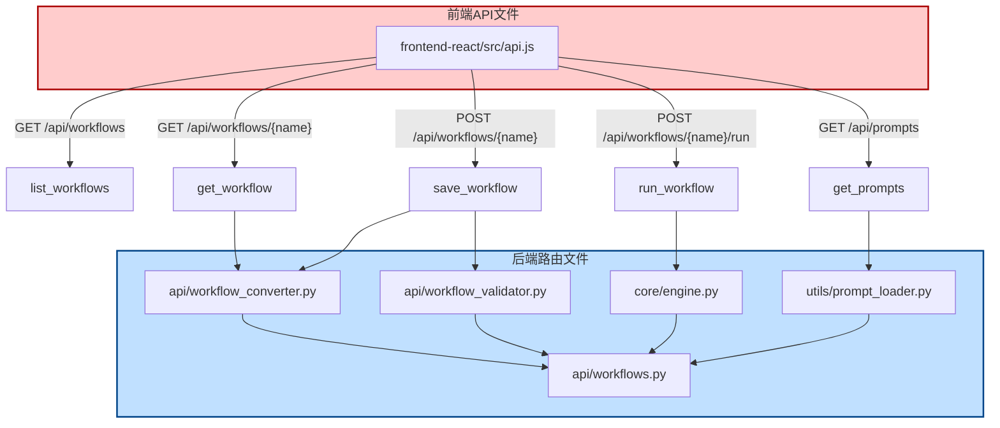
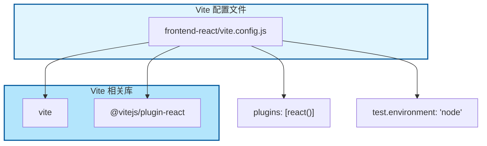
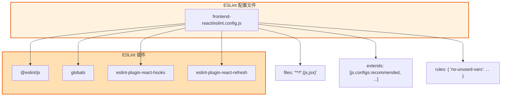
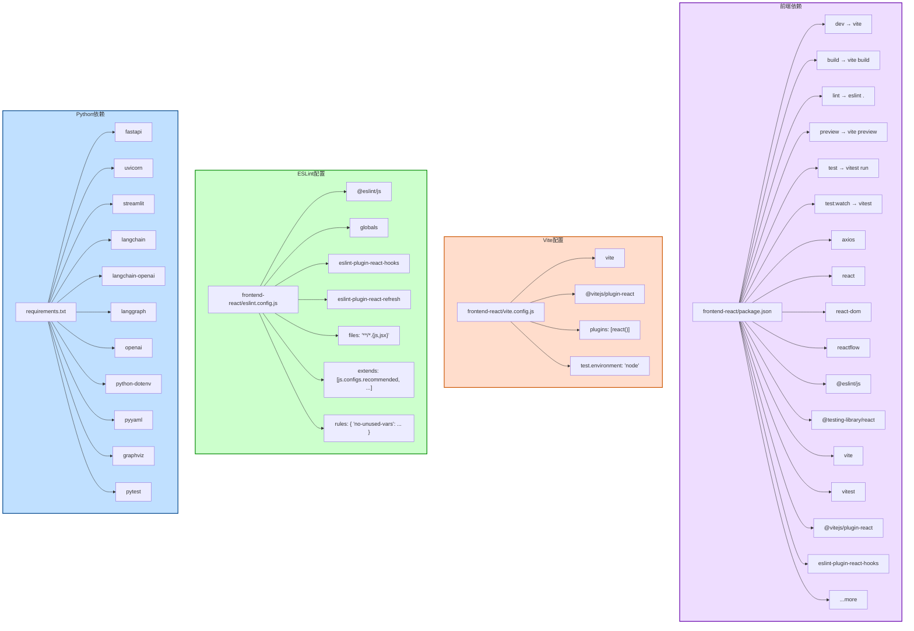

```mermaid 
graph TD
    subgraph backend[后端子系统]
        style backend fill:#e0f0ff,stroke:#0050a0,stroke-width:3px

        subgraph backend_entry[后端入口层]
            style backend_entry fill:#b0d0ff,stroke:#003070,stroke-width:2px
            app_py["app.py"]
            fastapi_app_py["fastapi_app.py"]
        end

        subgraph backend_api[API层]
            style backend_api fill:#c0e0ff,stroke:#004488,stroke-width:2px
            api_workflows["api/workflows.py"]
            api_converter["api/workflow_converter.py"]
            api_schemas["api/workflow_schemas.py"]
            api_validator["api/workflow_validator.py"]
            api_init["api/__init__.py"]
        end

        subgraph backend_core[核心引擎层]
            style backend_core fill:#ffffb0,stroke:#888800,stroke-width:2px
            core_engine["core/engine.py"]
            core_llm["core/llm.py"]
        end

        subgraph backend_utils[工具层]
            style backend_utils fill:#e0e0e0,stroke:#666666,stroke-width:2px
            utils_loader["utils/prompt_loader.py"]
        end

        streamlit["streamlit"]
        fastapi["fastapi"]
        pydantic["pydantic"]
        langchain_openai["langchain_openai.ChatOpenAI"]
        yaml["yaml"]
        pathlib["pathlib.Path"]
    end

    subgraph frontend[前端子系统]
        style frontend fill:#e0ffe0,stroke:#008000,stroke-width:3px

        subgraph frontend_entry[前端入口层]
            style frontend_entry fill:#ffeedd,stroke:#cc6600,stroke-width:2px
            main_jsx["frontend-react/src/main.jsx"]
            index_css["frontend-react/src/index.css"]
            app_jsx["frontend-react/src/App.jsx"]
        end

        subgraph frontend_editor_core[编辑器核心]
            style frontend_editor_core fill:#ffffcc,stroke:#aaaa00,stroke-width:2px
            workflow_editor["frontend-react/src/components/WorkflowEditor.jsx"]
        end

        subgraph frontend_components[组件层]
            style frontend_components fill:#ffddff,stroke:#aa00aa,stroke-width:2px
            node_config_panel["frontend-react/src/components/NodeConfigPanel.jsx"]
            workflow_node["frontend-react/src/components/WorkflowNode.jsx"]
            run_result_panel["frontend-react/src/components/RunResultPanel.jsx"]
            input_config["frontend-react/src/components/node-config/InputNodeConfig.jsx"]
            prompt_config["frontend-react/src/components/node-config/PromptNodeConfig.jsx"]
            output_config["frontend-react/src/components/node-config/OutputNodeConfig.jsx"]
        end

        subgraph frontend_operations[操作层]
            style frontend_operations fill:#ddddff,stroke:#0000aa,stroke-width:2px
            wf_operations["frontend-react/src/workflow-editor/operations/workflowEditorOperations.js"]
        end

        subgraph frontend_domain[领域层]
            style frontend_domain fill:#ccffcc,stroke:#008800,stroke-width:2px
            wf_graph["frontend-react/src/workflow-editor/domain/workflowEditorGraph.js"]
            wf_helpers["frontend-react/src/workflow-editor/domain/workflowEditorHelpers.js"]
            wf_mappers["frontend-react/src/workflow-editor/domain/workflowEditorMappers.js"]
            wf_nodefactory["frontend-react/src/workflow-editor/domain/workflowEditorNodeFactory.js"]
            wf_requests["frontend-react/src/workflow-editor/domain/workflowEditorRequests.js"]
            wf_valrules["frontend-react/src/workflow-editor/domain/workflowEditorValidationRules.js"]
            wf_validators["frontend-react/src/workflow-editor/domain/workflowEditorValidators.js"]
        end

        subgraph frontend_state[状态层]
            style frontend_state fill:#eeeeee,stroke:#666666,stroke-width:2px
            wf_runinputs["frontend-react/src/workflow-editor/state/workflowEditorRunInputs.js"]
            wf_selection["frontend-react/src/workflow-editor/state/workflowEditorSelection.js"]
            wf_viewstate["frontend-react/src/workflow-editor/state/workflowEditorViewState.js"]
        end

        subgraph frontend_api[API层]
            style frontend_api fill:#ffcccc,stroke:#aa0000,stroke-width:2px
            api_js["frontend-react/src/api.js"]
        end

        subgraph frontend_actions[动作层]
            style frontend_actions fill:#ffe0b0,stroke:#cc7700,stroke-width:2px
            wf_actions["frontend-react/src/workflow-editor/actions/workflowEditorActions.js"]
        end

        axios["axios"]
        react["react"]
        reactdom["react-dom"]
        reactflow["reactflow"]
    end

    %% 后端依赖关系
    app_py --> streamlit
    app_py --> core_engine

    fastapi_app_py --> fastapi
    fastapi_app_py --> api_workflows

    api_workflows --> utils_loader
    api_workflows --> core_engine
    api_workflows --> api_converter
    api_workflows --> api_schemas
    api_workflows --> api_validator
    api_workflows --> yaml
    api_workflows --> fastapi

    api_schemas --> pydantic

    api_validator --> fastapi

    core_engine --> utils_loader
    core_engine --> core_llm
    core_engine --> yaml

    core_llm --> langchain_openai

    utils_loader --> pathlib

    %% 前端依赖关系
    main_jsx --> reactdom
    main_jsx --> react
    main_jsx --> index_css
    main_jsx --> app_jsx

    app_jsx --> workflow_editor

    workflow_editor --> react
    workflow_editor --> reactflow
    workflow_editor --> api_js
    workflow_editor --> wf_operations
    workflow_editor --> node_config_panel
    workflow_editor --> run_result_panel
    workflow_editor --> workflow_node
    workflow_editor --> wf_actions
    workflow_editor --> wf_runinputs
    workflow_editor --> wf_selection
    workflow_editor --> wf_viewstate

    node_config_panel --> react
    node_config_panel --> input_config
    node_config_panel --> prompt_config
    node_config_panel --> output_config
    node_config_panel --> wf_nodefactory
    node_config_panel --> wf_helpers

    workflow_node --> react
    workflow_node --> reactflow

    run_result_panel --> react

    input_config --> react
    prompt_config --> react
    output_config --> react

    wf_actions --> wf_graph
    wf_actions --> wf_nodefactory

    wf_operations --> api_js
    wf_operations --> wf_mappers
    wf_operations --> wf_validators
    wf_operations --> wf_requests

    wf_graph --> reactflow
    wf_graph --> wf_helpers

    wf_mappers --> wf_helpers
    wf_nodefactory --> wf_helpers
    wf_validators --> wf_valrules

    api_js --> axios

    %% 前后端联系：前端通过 HTTP API 调用后端
    api_js -- "HTTP API calls" --> api_workflows
```

一版**完整成品树**，分成：

1. **项目级完整文件引用树**
2. **前端启动树**
3. **后端启动树**
4. **前后端接口衔接树**
5. **工程配置与依赖树**

---

# 一、项目级完整文件引用树

```text
ai-writer-mvp/
├── app.py                                                  # Streamlit 单页入口
│   ├── import
│   │   ├── streamlit
│   │   └── core.engine.WorkflowEngine
│   └── runtime path
│       └── workflows/article.yaml
│
├── fastapi_app.py                                          # FastAPI 服务入口
│   ├── import
│   │   ├── fastapi.FastAPI
│   │   ├── fastapi.middleware.cors.CORSMiddleware
│   │   └── api.workflows.router
│
├── api/
│   ├── __init__.py                                         # 空文件
│   │
│   ├── workflow_schemas.py                                 # Pydantic 数据结构层
│   │   ├── import
│   │   │   ├── pydantic.BaseModel
│   │   │   ├── pydantic.Field
│   │   │   └── typing
│   │
│   ├── workflow_converter.py                               # 编辑器 schema ↔ YAML 转换层
│   │   ├── import
│   │   │   └── （无外部项目文件引用）
│   │
│   ├── workflow_validator.py                               # 后端工作流校验层
│   │   ├── import
│   │   │   ├── re
│   │   │   └── fastapi.HTTPException
│   │
│   └── workflows.py                                        # 后端 API 路由主文件
│       ├── import
│       │   ├── fastapi.APIRouter
│       │   ├── fastapi.HTTPException
│       │   ├── utils.prompt_loader.list_prompts
│       │   ├── core.engine.WorkflowEngine
│       │   ├── api.workflow_converter.editor_schema_to_yaml
│       │   ├── api.workflow_converter.yaml_to_editor_schema
│       │   ├── api.workflow_schemas.RunRequest
│       │   ├── api.workflow_schemas.WorkflowEditorData
│       │   ├── api.workflow_validator.validate_workflow_editor_data
│       │   ├── yaml
│       │   └── os
│
├── core/
│   ├── engine.py                                           # 工作流执行引擎
│   │   ├── import
│   │   │   ├── json
│   │   │   ├── yaml
│   │   │   ├── collections.defaultdict
│   │   │   ├── collections.deque
│   │   │   ├── utils.prompt_loader.load_prompt
│   │   │   └── core.llm.get_llm
│   │
│   └── llm.py                                              # LLM 封装层
│       ├── import
│       │   └── langchain_openai.ChatOpenAI
│
├── utils/
│   └── prompt_loader.py                                    # prompt 文件读取层
│       ├── import
│       │   └── pathlib.Path
│
├── workflows/
│   └── *.yaml                                              # 工作流 YAML 文件目录；被 engine / workflows.py 读写
│
├── prompt/
│   └── *.txt                                               # prompt 模板目录；被 prompt_loader.py 读取
│
├── requirements.txt                                        # Python 依赖清单
│
└── frontend-react/
    ├── package.json                                        # 前端依赖与脚本
    ├── eslint.config.js                                    # ESLint 配置
    ├── vite.config.js                                      # Vite 配置
    │
    └── src/
        ├── main.jsx                                        # React 前端入口
        │   ├── import
        │   │   ├── react.StrictMode
        │   │   ├── react-dom/client.createRoot
        │   │   ├── ./index.css
        │   │   └── ./App.jsx
        │
        ├── App.jsx                                         # 前端应用壳；直接挂 WorkflowEditor
        │   ├── import
        │   │   └── ./components/WorkflowEditor
        │
        ├── App.css                                         # 当前未被 App.jsx 引用
        │
        ├── index.css                                       # 被 main.jsx 引用
        │
        ├── api.js                                          # 前端 API 请求封装层
        │   ├── import
        │   │   └── axios
        │
        ├── components/
        │   ├── WorkflowEditor.jsx                          # 前端主控中心
        │   │   ├── import
        │   │   │   ├── react
        │   │   │   ├── reactflow
        │   │   │   ├── reactflow/dist/style.css
        │   │   │   ├── ../api
        │   │   │   ├── ../workflow-editor/operations/workflowEditorOperations
        │   │   │   ├── ./NodeConfigPanel
        │   │   │   ├── ./RunResultPanel
        │   │   │   ├── ./WorkflowNode
        │   │   │   ├── ../workflow-editor/actions/workflowEditorActions
        │   │   │   ├── ../workflow-editor/state/workflowEditorViewState
        │   │   │   ├── ../workflow-editor/state/workflowEditorRunInputs
        │   │   │   └── ../workflow-editor/state/workflowEditorSelection
        │   │   └── provides nodeTypes
        │   │       └── workflowNode -> WorkflowNode
        │   │
        │   ├── NodeConfigPanel.jsx                         # 右侧节点配置总面板
        │   │   ├── import
        │   │   │   ├── react
        │   │   │   ├── ./node-config/InputNodeConfig
        │   │   │   ├── ./node-config/OutputNodeConfig
        │   │   │   ├── ./node-config/PromptNodeConfig
        │   │   │   ├── ../workflow-editor/domain/workflowEditorNodeFactory
        │   │   │   └── ../workflow-editor/domain/workflowEditorHelpers
        │   │
        │   ├── WorkflowNode.jsx                            # ReactFlow 自定义节点组件
        │   │   ├── import
        │   │   │   ├── react
        │   │   │   └── reactflow
        │   │
        │   ├── RunResultPanel.jsx                          # 运行结果展示面板
        │   │   ├── import
        │   │   │   └── react
        │   │
        │   └── node-config/
        │       ├── InputNodeConfig.jsx                     # input 节点配置子面板
        │       │   ├── import
        │       │   │   └── react
        │       │
        │       ├── PromptNodeConfig.jsx                    # prompt 节点配置子面板
        │       │   ├── import
        │       │   │   └── react
        │       │
        │       └── OutputNodeConfig.jsx                    # output 节点配置子面板
        │           ├── import
        │           │   └── react
        │
        └── workflow-editor/
            ├── actions/
            │   └── workflowEditorActions.js                # 编辑动作层
            │       ├── import
            │       │   ├── ../domain/workflowEditorGraph
            │       │   └── ../domain/workflowEditorNodeFactory
            │
            ├── operations/
            │   └── workflowEditorOperations.js             # 异步操作层
            │       ├── import
            │       │   ├── ../../api
            │       │   ├── ../domain/workflowEditorMappers
            │       │   ├── ../domain/workflowEditorValidators
            │       │   └── ../domain/workflowEditorRequests
            │
            ├── state/
            │   ├── workflowEditorRunInputs.js              # runInputs 派生层
            │   │   ├── import
            │   │   │   └── （无外部项目文件引用）
            │   │
            │   ├── workflowEditorSelection.js              # 选中状态派生层
            │   │   ├── import
            │   │   │   └── （无外部项目文件引用）
            │   │
            │   └── workflowEditorViewState.js              # 执行态显示派生层
            │       ├── import
            │       │   └── （无外部项目文件引用）
            │
            └── domain/
                ├── workflowEditorGraph.js                  # 图规则层
                │   ├── import
                │   │   ├── reactflow
                │   │   └── ./workflowEditorHelpers
                │
                ├── workflowEditorHelpers.js                # 底层 helper 层
                │   ├── import
                │   │   └── （无外部项目文件引用）
                │
                ├── workflowEditorMappers.js                # 前后端数据映射层
                │   ├── import
                │   │   └── ./workflowEditorHelpers
                │
                ├── workflowEditorNodeFactory.js            # 节点创建/规范化层
                │   ├── import
                │   │   └── ./workflowEditorHelpers
                │
                ├── workflowEditorRequests.js               # 请求辅助层
                │   ├── import
                │   │   └── （无外部项目文件引用）
                │
                ├── workflowEditorValidationRules.js        # 细粒度校验规则层
                │   ├── import
                │   │   └── （无外部项目文件引用）
                │
                └── workflowEditorValidators.js             # 保存前总校验层
                    ├── import
                    │   └── ./workflowEditorValidationRules
```

---

# 二、前端启动树

```text
frontend-react/src/main.jsx
├── ./index.css
└── ./App.jsx
    └── ./components/WorkflowEditor
        ├── ../api
        │   └── axios
        ├── ../workflow-editor/operations/workflowEditorOperations
        │   ├── ../../api
        │   ├── ../domain/workflowEditorMappers
        │   │   └── ./workflowEditorHelpers
        │   ├── ../domain/workflowEditorValidators
        │   │   └── ./workflowEditorValidationRules
        │   └── ../domain/workflowEditorRequests
        ├── ./NodeConfigPanel
        │   ├── ./node-config/InputNodeConfig
        │   ├── ./node-config/PromptNodeConfig
        │   ├── ./node-config/OutputNodeConfig
        │   ├── ../workflow-editor/domain/workflowEditorNodeFactory
        │   │   └── ./workflowEditorHelpers
        │   └── ../workflow-editor/domain/workflowEditorHelpers
        ├── ./RunResultPanel
        ├── ./WorkflowNode
        │   └── reactflow
        ├── ../workflow-editor/actions/workflowEditorActions
        │   ├── ../domain/workflowEditorGraph
        │   │   ├── reactflow
        │   │   └── ./workflowEditorHelpers
        │   └── ../domain/workflowEditorNodeFactory
        │       └── ./workflowEditorHelpers
        ├── ../workflow-editor/state/workflowEditorRunInputs
        ├── ../workflow-editor/state/workflowEditorSelection
        └── ../workflow-editor/state/workflowEditorViewState
```
按功能模块划分为：入口层（橙色）、编辑器核心（黄色）、组件层（粉色）、操作层（紫色）、领域层（青色）、状态层（灰色）、API层（棕色）。

```mermaid 
graph TD
    subgraph entry[入口层]
        style entry fill:#ffeedd,stroke:#cc6600,stroke-width:2px
        main["frontend-react/src/main.jsx"]
        index_css["frontend-react/src/index.css"]
        app["frontend-react/src/App.jsx"]
    end

    subgraph editor_core[编辑器核心]
        style editor_core fill:#ffffcc,stroke:#aaaa00,stroke-width:2px
        editor["frontend-react/src/components/WorkflowEditor.jsx"]
    end

    subgraph components[组件层]
        style components fill:#ffddff,stroke:#aa00aa,stroke-width:2px
        config_panel["frontend-react/src/components/NodeConfigPanel.jsx"]
        input_config["frontend-react/src/components/node-config/InputNodeConfig.jsx"]
        prompt_config["frontend-react/src/components/node-config/PromptNodeConfig.jsx"]
        output_config["frontend-react/src/components/node-config/OutputNodeConfig.jsx"]
        result_panel["frontend-react/src/components/RunResultPanel.jsx"]
        wf_node["frontend-react/src/components/WorkflowNode.jsx"]
    end

    subgraph operations[操作层]
        style operations fill:#ddddff,stroke:#0000aa,stroke-width:2px
        operations_mod["frontend-react/src/workflow-editor/operations/workflowEditorOperations.js"]
        actions["frontend-react/src/workflow-editor/actions/workflowEditorActions.js"]
    end

    subgraph domain[领域层]
        style domain fill:#ccffcc,stroke:#008800,stroke-width:2px
        mappers["frontend-react/src/workflow-editor/domain/workflowEditorMappers.js"]
        helpers["frontend-react/src/workflow-editor/domain/workflowEditorHelpers.js"]
        validators["frontend-react/src/workflow-editor/domain/workflowEditorValidators.js"]
        valrules["frontend-react/src/workflow-editor/domain/workflowEditorValidationRules.js"]
        requests["frontend-react/src/workflow-editor/domain/workflowEditorRequests.js"]
        nodefactory["frontend-react/src/workflow-editor/domain/workflowEditorNodeFactory.js"]
        graph_module["frontend-react/src/workflow-editor/domain/workflowEditorGraph.js"]
    end

    subgraph state[状态层]
        style state fill:#eeeeee,stroke:#666666,stroke-width:2px
        runinputs["frontend-react/src/workflow-editor/state/workflowEditorRunInputs.js"]
        selection["frontend-react/src/workflow-editor/state/workflowEditorSelection.js"]
        viewstate["frontend-react/src/workflow-editor/state/workflowEditorViewState.js"]
    end

    subgraph api[API层]
        style api fill:#ffcccc,stroke:#aa0000,stroke-width:2px
        api_mod["frontend-react/src/api.js"]
    end

    react["react"]
    reactdom["react-dom"]
    reactflow["reactflow"]
    axios["axios"]

    main --> index_css
    main --> app
    main --> reactdom

    app --> editor

    editor --> react
    editor --> reactflow
    editor --> api_mod
    editor --> operations_mod
    editor --> config_panel
    editor --> result_panel
    editor --> wf_node
    editor --> actions
    editor --> runinputs
    editor --> selection
    editor --> viewstate

    config_panel --> react
    config_panel --> input_config
    config_panel --> prompt_config
    config_panel --> output_config
    config_panel --> nodefactory
    config_panel --> helpers

    input_config --> react
    prompt_config --> react
    output_config --> react

    operations_mod --> api_mod
    operations_mod --> mappers
    operations_mod --> validators
    operations_mod --> requests

    mappers --> helpers
    validators --> valrules
    nodefactory --> helpers
    actions --> graph_module
    actions --> nodefactory
    graph_module --> reactflow
    graph_module --> helpers

    wf_node --> react
    wf_node --> reactflow

    result_panel --> react

    api_mod --> axios
```

---

# 三、后端启动树

## 1. FastAPI 启动树

```text
fastapi_app.py
└── api.workflows.router
    └── api/workflows.py
        ├── utils.prompt_loader.list_prompts
        ├── core.engine.WorkflowEngine
        │   ├── utils.prompt_loader.load_prompt
        │   └── core.llm.get_llm
        │       └── langchain_openai.ChatOpenAI
        ├── api.workflow_converter.editor_schema_to_yaml
        ├── api.workflow_converter.yaml_to_editor_schema
        ├── api.workflow_schemas.RunRequest
        ├── api.workflow_schemas.WorkflowEditorData
        └── api.workflow_validator.validate_workflow_editor_data
```
划分为：FastAPI入口（浅蓝）、API层（浅绿）、核心层（浅黄）、工具层（浅灰）。

## 2. Streamlit 启动树

```text
app.py
└── core.engine.WorkflowEngine
    ├── utils.prompt_loader.load_prompt
    └── core.llm.get_llm
        └── langchain_openai.ChatOpenAI
```
划分为：Streamlit入口（浅蓝）、核心引擎层（浅黄）、工具层（浅灰）。

---

# 四、前后端接口衔接树

这部分不是 import 跨语言直接引用，而是“前端 API 文件”和“后端路由文件”的接口对应树。

```text
frontend-react/src/api.js
├── GET  /api/workflows
│   └── 对应后端 api/workflows.py -> list_workflows
│
├── GET  /api/workflows/{name}
│   └── 对应后端 api/workflows.py -> get_workflow
│       └── api.workflow_converter.yaml_to_editor_schema
│
├── POST /api/workflows/{name}
│   └── 对应后端 api/workflows.py -> save_workflow
│       ├── api.workflow_validator.validate_workflow_editor_data
│       └── api.workflow_converter.editor_schema_to_yaml
│
├── POST /api/workflows/{name}/run
│   └── 对应后端 api/workflows.py -> run_workflow
│       └── core.engine.WorkflowEngine
│
└── GET  /api/prompts
    └── 对应后端 api/workflows.py -> get_prompts
        └── utils.prompt_loader.list_prompts
```
划分为：前端API文件（粉色）、后端路由文件（蓝色）。接口对应关系通过连线自然呈现。

---

# 五、工程配置与依赖树

这部分不属于业务 import 树主干，但你既然补了，我也一起收进去。

## 1. 前端工程配置树

```text
frontend-react/package.json
├── scripts
│   ├── dev -> vite
│   ├── build -> vite build
│   ├── lint -> eslint .
│   ├── preview -> vite preview
│   ├── test -> vitest run
│   └── test:watch -> vitest
├── dependencies
│   ├── axios
│   ├── react
│   ├── react-dom
│   └── reactflow
└── devDependencies
    ├── @eslint/js
    ├── @testing-library/jest-dom
    ├── @testing-library/react
    ├── @types/react
    ├── @types/react-dom
    ├── @vitejs/plugin-react
    ├── eslint
    ├── eslint-plugin-react-hooks
    ├── eslint-plugin-react-refresh
    ├── globals
    ├── jsdom
    ├── vite
    └── vitest
```

```mermaid 
graph TD
    subgraph PackageJson ["package.json"]
        package_json["frontend-react/package.json"]
    end
    style PackageJson fill:#fff9c4,stroke:#fbc02d,stroke-width:2px;

    subgraph Scripts ["脚本命令"]
        dev["dev → vite"]
        build["build → vite build"]
        lint["lint → eslint ."]
        preview["preview → vite preview"]
        test["test → vitest run"]
        test_watch["test:watch → vitest"]
    end
    style Scripts fill:#ffe082,stroke:#fbc02d,stroke-width:2px;

    subgraph Dependencies ["生产依赖"]
        axios["axios"]
        react["react"]
        react_dom["react-dom"]
        reactflow["reactflow"]
    end
    style Dependencies fill:#ffd54f,stroke:#fbc02d,stroke-width:2px;

    subgraph DevDependencies ["开发依赖"]
        eslint["@eslint/js"]
        testing_lib["@testing-library/react"]
        vite["vite"]
        vitest["vitest"]
        plugin_react["@vitejs/plugin-react"]
        eslint_plugins["eslint-plugin-react-hooks"]
        more["...more"]
    end
    style DevDependencies fill:#ffb74d,stroke:#fbc02d,stroke-width:2px;

    package_json --> dev
    package_json --> build
    package_json --> lint
    package_json --> preview
    package_json --> test
    package_json --> test_watch
    package_json --> axios
    package_json --> react
    package_json --> react_dom
    package_json --> reactflow
    package_json --> eslint
    package_json --> testing_lib
    package_json --> vite
    package_json --> vitest
    package_json --> plugin_react
    package_json --> eslint_plugins
```

## 2. Vite 配置树

```text
frontend-react/vite.config.js
├── import
│   ├── vite.defineConfig
│   └── @vitejs/plugin-react
└── config
    ├── plugins -> [react()]
    └── test.environment -> "node"
```

## 3. ESLint 配置树

```text
frontend-react/eslint.config.js
├── import
│   ├── @eslint/js
│   ├── globals
│   ├── eslint-plugin-react-hooks
│   ├── eslint-plugin-react-refresh
│   └── eslint/config
└── config
    ├── files -> **/*.{js,jsx}
    ├── extends
    │   ├── js.configs.recommended
    │   ├── reactHooks.configs.flat.recommended
    │   └── reactRefresh.configs.vite
    └── rules
        └── no-unused-vars
```

## 4. Python 依赖树

```text
requirements.txt
├── fastapi
├── uvicorn
├── streamlit
├── langchain
├── langchain-openai
├── langgraph
├── openai
├── python-dotenv
├── pyyaml
├── graphviz
└── pytest
```

5. 工程配置与依赖树
划分为四个子图：前端依赖（浅紫）、Vite配置（浅橙）、ESLint配置（浅绿）、Python依赖（浅蓝）。

---

# 六、补充说明

现在这份树已经可以视为**完整版本**，并且有几个明确结论：

## 1. 业务主树已经完整

你当前项目里，和“工作流编辑器 / 保存 / 运行 / Prompt / 引擎执行”直接相关的文件引用关系，已经全部覆盖。

## 2. `App.css` 当前没有被引用

从你给的代码看：

* `main.jsx` 只引了 `index.css`
* `App.jsx` 只引了 `WorkflowEditor`

所以当前 `App.css` 是存在但未接入的文件。

## 3. `api/__init__.py` 对树没有增量信息

因为它是空文件。

## 4. `core/__init__.py`、`utils/__init__.py` 不存在

不影响这份引用树成立。

---


